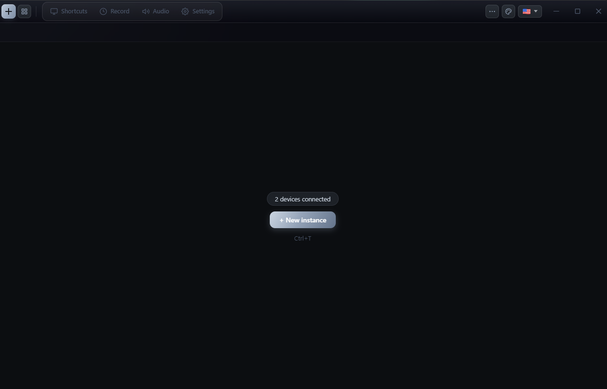

# Vortynix — Landing page (Cockpit build)

A single-file, self-contained landing page for Vortynix, built around a **cockpit / mission-control** concept so it doesn't look like a generic SaaS template. No build step, no dependencies — open `index.html` or drop the folder on any static host (GitHub Pages, Netlify, Vercel, Cloudflare Pages).

```
vortynix-web/
├── index.html      ← the whole site (HTML + CSS + JS inline)
├── assets/         ← put your images / videos here
└── README.md
```

## The concept

The page presents Vortynix as a **control deck**, not a brochure:
- A **status rail** instead of a normal navbar (system readout, callsign).
- A **primary viewport** with HUD corner brackets + a live telemetry strip.
- Features shown as an **instrument panel** (a 12-col instrument grid with codes like `INST·MULTI`).
- "How it works" is a **launch sequence log** (T-00 → T-03) with a sticky replay viewport.
- Palettes shown as a hardware **chip bank**.
- Download is a **"cleared for download"** launch console.

## What to replace (placeholders)

Every placeholder is marked with `data-ph="..."` and renders as a dashed HUD box. Search the file for `PLACEHOLDER`.

### Visuals
Replace each `<div class="ph ...">` block with a real image or video:

```html

```
```html
<video src="assets/hero.mp4" autoplay muted loop playsinline></video>
```

- `data-ph="hero"` → `assets/hero.png` (or a demo video) — the primary viewport
- `data-ph="tabs"` → `assets/tabs.png` — inside the multi-instance instrument
- `data-ph="sequence"` → `assets/sequence.png` (or `.mp4`) — the replay viewport

Keep visuals **16:9** (e.g. 1920×1080); the `.ph-169` class reserves that ratio.

### Links
Change `href="#"` on elements with:
- `data-ph="download-link"` → installer / GitHub release
- `data-ph="github-link"` / `data-ph="link"` → GitHub, Discord, docs, changelog

## Customizing

- **Accent color:** the cockpit HUD teal is `--hud` in `:root`. Change it (and `--hud-dim`) to re-theme the whole deck. Steel/ink tones are `--steel`, `--ink`, `--ink2`, `--ink3`.
- **Copy:** all plain HTML, edit in place.
- **Version:** search `v1.7.0`.
- **Fonts:** Space Grotesk + JetBrains Mono via Google Fonts. For offline, download into `assets/` and update the `<link>`.

All animations (scanline sweep, scroll reveal, HUD blinks) are vanilla CSS/JS — no libraries.
